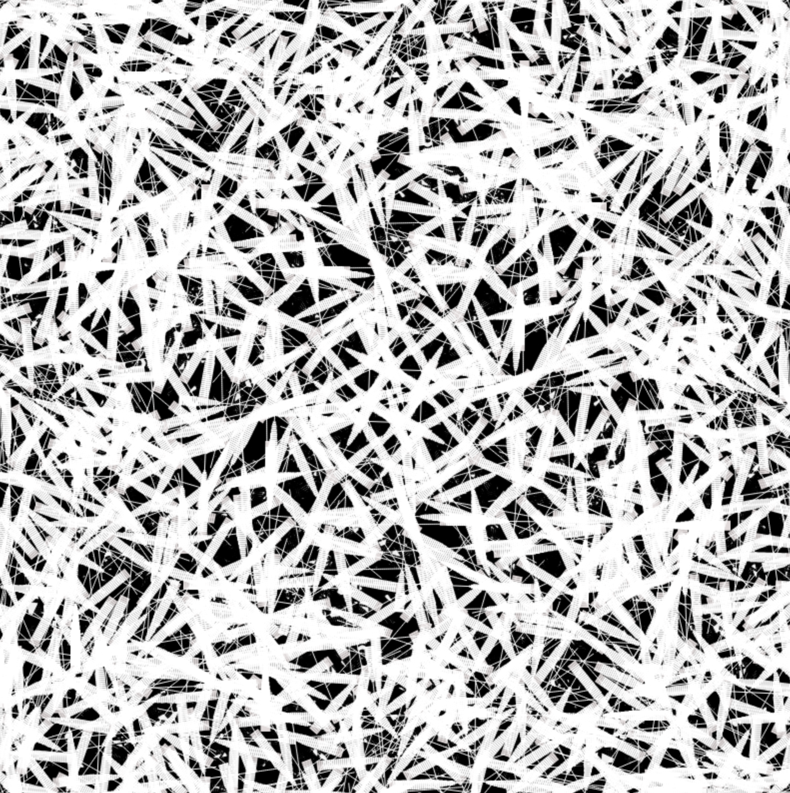
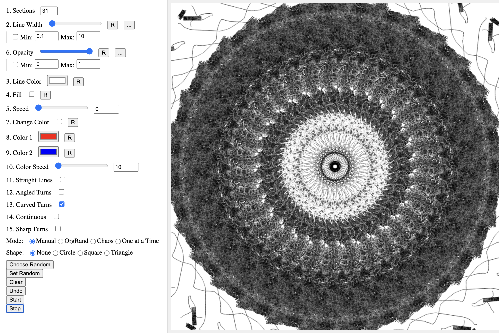
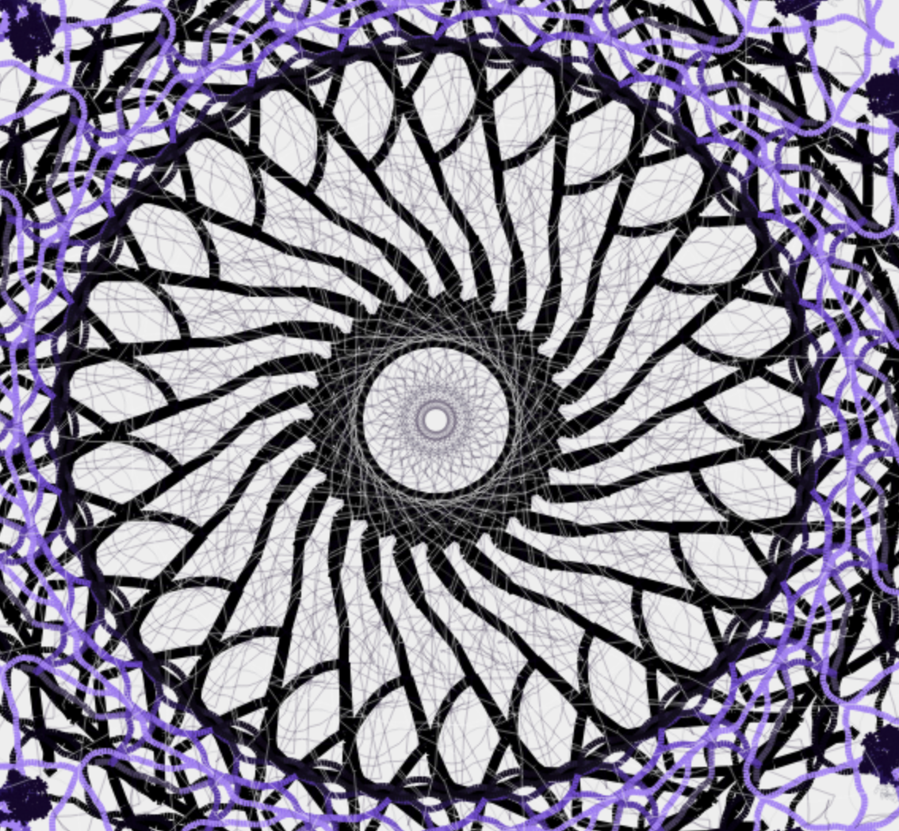
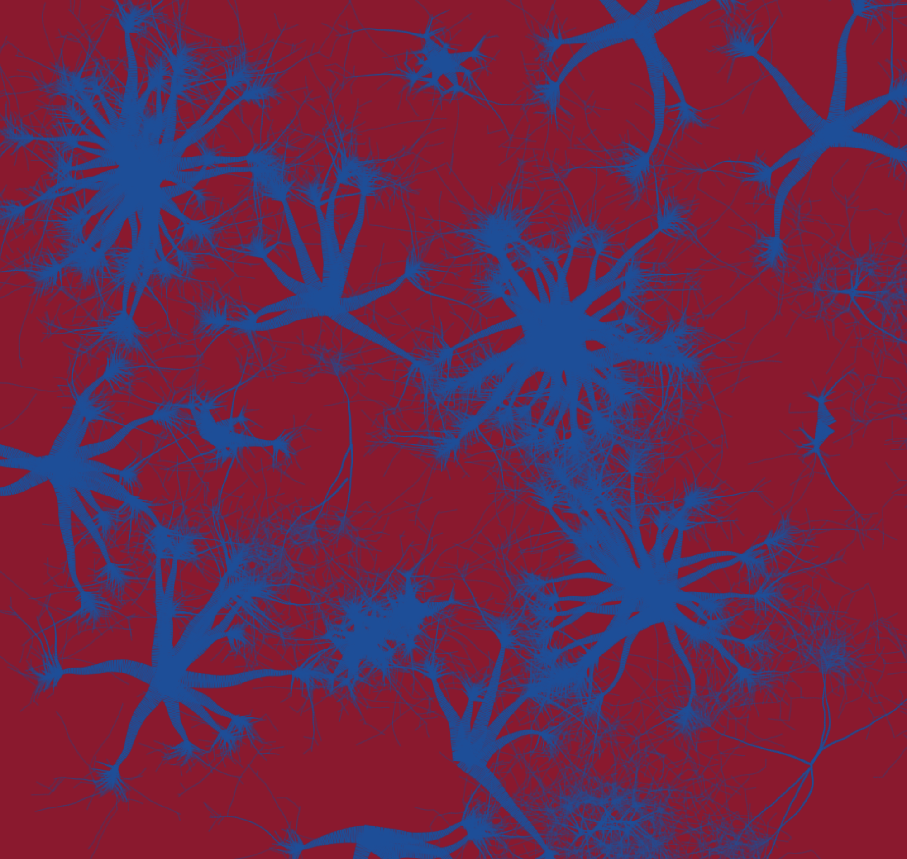
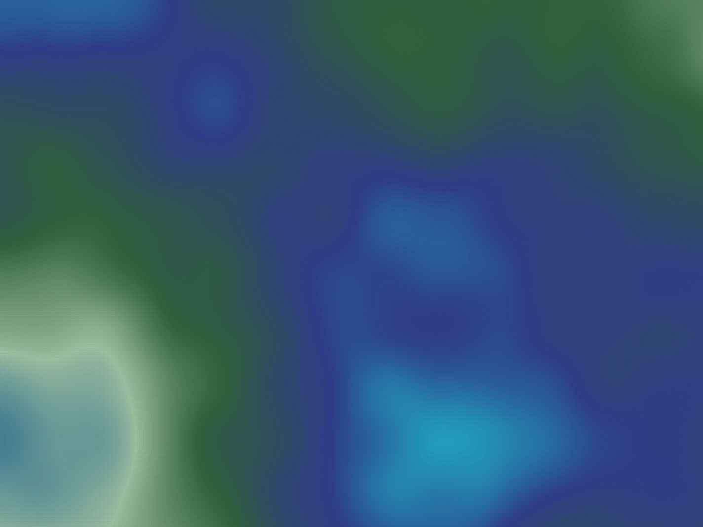

# Generative Art Playgrounds

Welcome to the Generative Art Playgrounds! This project is a collection of interactive generative art tools that allow you to create beautiful, algorithmically-generated artworks. Explore the different tools to create unique and mesmerizing patterns, shapes, and landscapes.

## Tools

### 1. Mandala Drawer
Create intricate and symmetrical mandalas with ease. Customize the patterns and colors to your liking.

[Mandala Drawer](https://yossichen78.github.io/generative-art/mandala/index.html)

### 2. Generative Trees
Generate realistic and abstract trees using procedural generation techniques. Adjust the parameters to create a variety of tree shapes and styles.

[Generative Trees](https://yossichen78.github.io/generative-art/generative%20trees/index.html)

### 3. Flow Fields
Visualize and interact with dynamic flow fields. Control the particle behavior and field characteristics to produce stunning flow-based artworks.

[Flow Fields](https://yossichen78.github.io/generative-art/flow%20field/index.html)

### 4. Topographic Map
Generate random topographic maps with customizable colors and elevation patterns. Use the mouse to interact with the map and create gentle waves or ripples.

[Topographic Map](https://yossichen78.github.io/generative-art/topographic%20map/index.html)

### 5. Divided Shapes
Create complex patterns by dividing shapes into smaller parts. Customize the division rules and colors to produce intricate and fascinating designs.

[Divided Shapes](https://yossichen78.github.io/generative-art/divided%20shapes/index.html)

## Usage

Each tool provides a unique interface with controls that allow you to customize various parameters. Simply visit the link of the tool you are interested in and start experimenting with the controls to create your own generative art.

## Contributing

If you have any suggestions or improvements, feel free to open an issue or submit a pull request. Contributions are welcome!

## License

This project is licensed under the MIT License. See the [LICENSE](LICENSE) file for more details.

Enjoy creating generative art!
